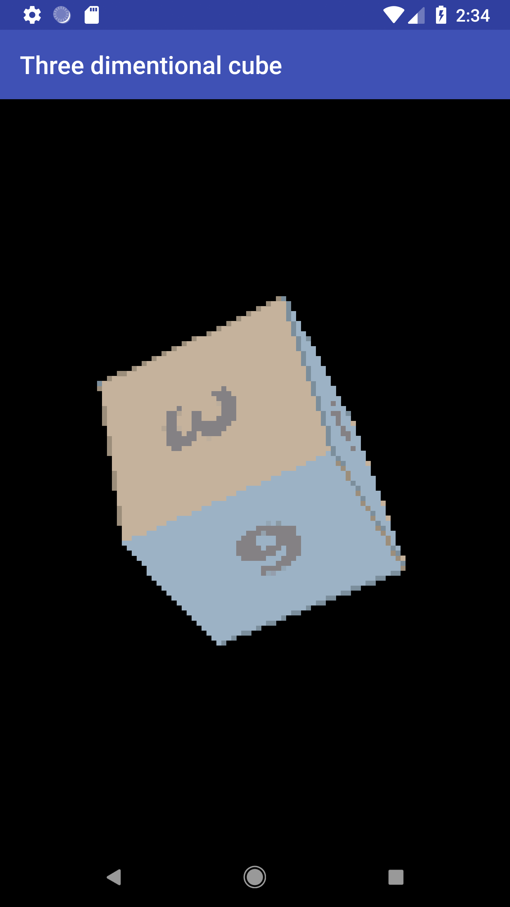
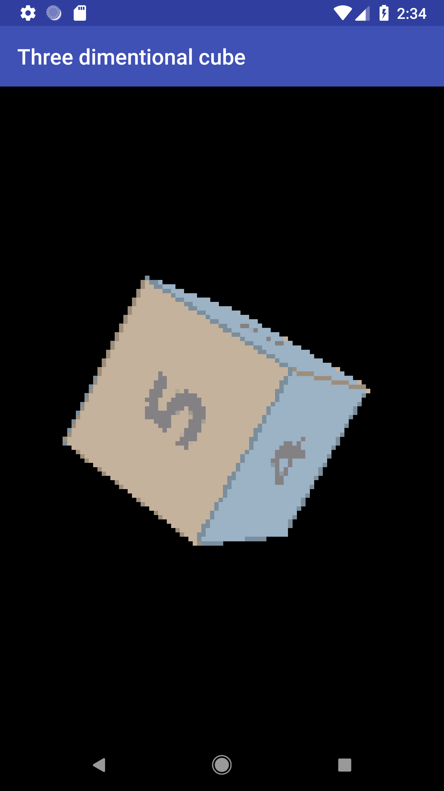

# 3D-Cube 
### Using c++,cmake, pure math and putPixel equivalent in openGL

### Drawing colored 3d-cube

### Drawing 3d-cube with texture

### Android port
<div
    style="flex-direction:row"
>


</div>

### IOS port


## How to run project ?

### Windows:
Install following dependencies :
- Cmake
- Ninja
- Vcpkg

Install following dependencies using Vcpkg:
```
Vcpkg install OpenGl
Vcpkg install FreeGlut
```

Run project:
```
cmake . -GNinja -DCMAKE_TOOLCHAIN_FILE=<Vcpkg toolchain file address>
ninja
./3d-cube.exe
``` 
Also if you have node installed modify package.json for vcpkg toolchain address and then just run
```
npm run start
```

### Mac:
Install following dependencies : 
- Cmake

Run project:
```
cmake . && make && ./3d-cube
``` 

For all desktop apps you can add -DCMAKE_BUILD_TYPE=Release to build for release mode

### Linux:
Install VCPKG and cmake

in VCPKG folder install following librarys
```
vcpkg install OpenGL
vcpkg install FreeGlut
```

Run project
```
cmake . -DCMAKE_TOOLCHAIN_FILE=<Vcpkg toolchain file address> 
make
./3d-cube
```

### IOS
Open xcode project and set your team id bundle identifier and then run project.

### Android
Open android folder using android studio and then run project.

##### #3d #OpenGL #c++ #cmak3 #mac #windows #ubuntu #android #ios
